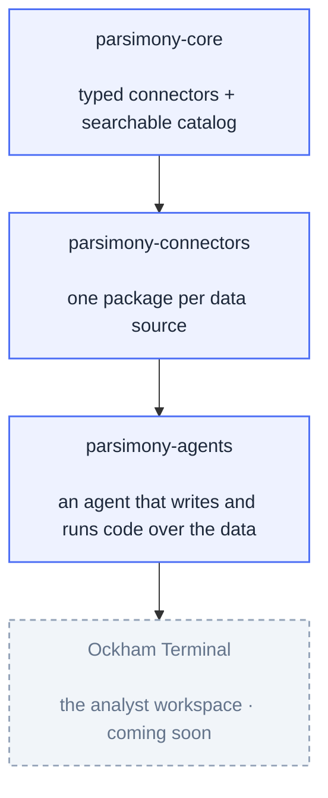

<div align="center">

# Ockham

### Agent-native infrastructure for financial and economic data analysis

Typed data connectors, a portable search catalog, and an agent that writes and runs its own code,<br/>
so AI can do real analytical work over financial and economic data.

[](https://docs.parsimony.dev)
[](https://pypi.org/project/parsimony-core/)
[](https://www.apache.org/licenses/LICENSE-2.0)
[](https://www.python.org/)

</div>

## How it fits together



A connector is just an `async` Python function that returns a typed result with full provenance. The catalog makes thousands of series discoverable by keyword and by meaning at once. The agent finds the right data, writes Python against the typed results, runs it in a sandbox, and returns datasets, charts, and reports you can trace end to end.

## Projects

<table>
<tr>
<td width="50%" valign="top">

<a href="https://github.com/ockham-sh/parsimony">
  <picture>
    <source media="(prefers-color-scheme: dark)" srcset="https://github-readme-stats.vercel.app/api/pin/?username=ockham-sh&repo=parsimony&theme=github_dark&hide_border=true&description_lines_count=2&icon_color=4c6ef5&title_color=4c6ef5" />
    
  </picture>
</a>

<sub>The kernel: typed connectors + a hybrid-search catalog.</sub><br/>
<code>pip install parsimony-core</code>

</td>
<td width="50%" valign="top">

<a href="https://github.com/ockham-sh/parsimony-connectors">
  <picture>
    <source media="(prefers-color-scheme: dark)" srcset="https://github-readme-stats.vercel.app/api/pin/?username=ockham-sh&repo=parsimony-connectors&theme=github_dark&hide_border=true&description_lines_count=2&icon_color=4c6ef5&title_color=4c6ef5" />
    
  </picture>
</a>

<sub>FRED, SDMX, FMP, SEC EDGAR, BLS, EIA, central banks, and more.</sub><br/>
<code>pip install parsimony-fred</code>

</td>
</tr>
<tr>
<td width="50%" valign="top">

<a href="https://github.com/ockham-sh/parsimony-agents">
  <picture>
    <source media="(prefers-color-scheme: dark)" srcset="https://github-readme-stats.vercel.app/api/pin/?username=ockham-sh&repo=parsimony-agents&theme=github_dark&hide_border=true&description_lines_count=2&icon_color=4c6ef5&title_color=4c6ef5" />
    
  </picture>
</a>

<sub>An agent that writes and runs Python to analyze the data.</sub><br/>
<code>pip install parsimony-agents</code>

</td>
<td width="50%" valign="top">

<a href="https://ockham.sh">
  
</a>

<br/><br/>
<sub>The analyst workspace built on the stack: an embedded coding agent does the work while you direct and review, every artifact saved with full lineage. Open-core (AGPL-3.0 + enterprise edition).</sub>

</td>
</tr>
</table>

## Quickstart

```bash
pip install parsimony-agents
```

Bring your own connectors and your own model, then follow the [quickstart](https://docs.parsimony.dev).

## Community

- **Docs** &middot; [docs.parsimony.dev](https://docs.parsimony.dev)
- **Discussions & issues** &middot; on each repository above
- **Security** &middot; [security policy](https://github.com/ockham-sh/.github/blob/main/SECURITY.md) or security@ockham.sh

## License

The parsimony data stack (core, connectors, agents) is **Apache-2.0**. Ockham Terminal is **open-core**: an AGPL-3.0 core plus a separately-licensed enterprise edition.
